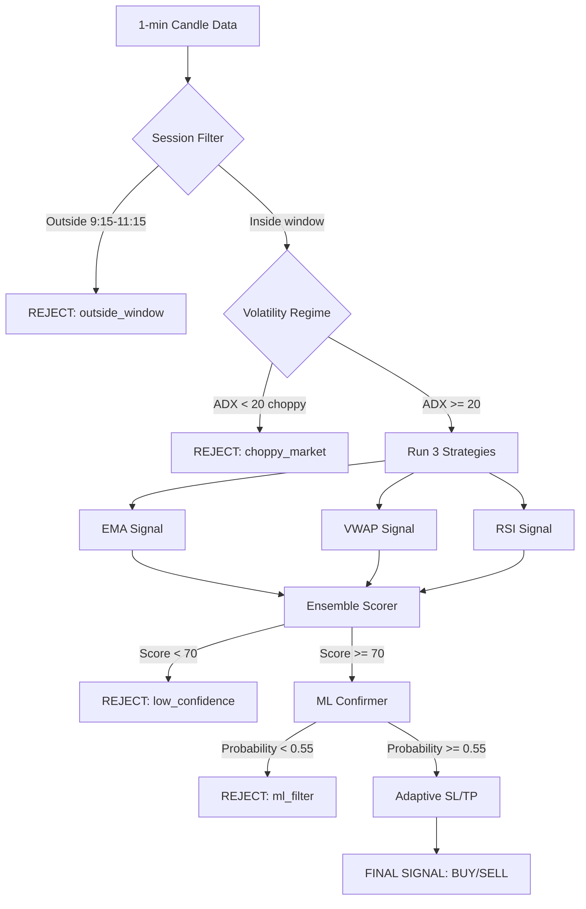

# Design: Improve Scalping Strategy Win Rate to 60%+

## Overview
This design covers the implementation of 5 improvements to the scalping module: market session filter, volatility regime filter, ensemble signal scoring, adaptive stop loss, and ML signal confirmation. All improvements are additive — they layer on top of the existing strategy infrastructure without breaking it.

---

## Architecture

```
Signal Generation Pipeline (New Flow):

Raw 1-min Data
    ↓
[1] Session Filter          → Reject if outside 9:15-11:15 AM
    ↓
[2] Volatility Regime       → Reject if ADX < 20 (choppy)
    ↓
[3] Individual Strategies   → EMA + VWAP + RSI signals
    ↓
[4] Ensemble Scorer         → Weighted combination (score 0-100)
    ↓
[5] ML Confirmation         → Probability filter (>0.55 to pass)
    ↓
[6] Adaptive SL/TP          → ATR-based dynamic levels
    ↓
Final Signal: BUY / SELL / HOLD
```

---

## Components and Interfaces

### 1. SessionFilter (`scalping/filters/session_filter.py`)

```python
class SessionFilter:
    def is_trading_time(self, timestamp, market: str = "NSE") -> bool:
        """Returns True if within optimal trading window"""
    
    def should_close_positions(self, timestamp, market: str = "NSE") -> bool:
        """Returns True if within 15 min of market close"""
    
    def get_trading_window(self, market: str) -> Tuple[time, time]:
        """Returns (start_time, end_time) for the market"""
```

**Trading Windows:**
- NSE: 09:15 - 11:15 IST (optimal), close positions at 15:15
- NYSE: 09:30 - 11:30 EST (optimal), close positions at 15:45

---

### 2. VolatilityRegimeDetector (`scalping/filters/regime_filter.py`)

```python
class VolatilityRegimeDetector:
    def detect_regime(self, data: pd.DataFrame) -> Dict[str, Any]:
        """
        Returns:
        {
            'regime': 'trending' | 'choppy' | 'strong_trend',
            'adx': float,
            'atr': float,
            'atr_ratio': float,  # current ATR / avg ATR
            'tradeable': bool
        }
        """
    
    def get_position_size_multiplier(self, regime: Dict) -> float:
        """Returns 0.5 for low volatility, 1.0 for normal, 1.2 for strong trend"""
```

**ADX Thresholds:**
- ADX < 20: Choppy → reject all signals
- ADX 20-40: Trending → allow signals
- ADX > 40: Strong trend → allow with bonus confidence

---

### 3. EnsembleScorer (`scalping/ensemble_scorer.py`)

```python
class EnsembleScorer:
    WEIGHTS = {'ema': 0.40, 'vwap': 0.35, 'rsi': 0.25}
    
    def calculate_score(self, data: pd.DataFrame) -> Dict[str, Any]:
        """
        Returns:
        {
            'score': float (0-100),
            'direction': 'BUY' | 'SELL' | 'HOLD',
            'agreement': int (1, 2, or 3 strategies agree),
            'breakdown': {'ema': score, 'vwap': score, 'rsi': score}
        }
        """
    
    def _get_strategy_signal(self, strategy_name: str, data: pd.DataFrame) -> Tuple[str, float]:
        """Returns (direction, confidence) for a single strategy"""
```

**Scoring Logic:**
```
base_score = weighted average of individual strategy scores
if 2/3 strategies agree: base_score += 10
if 3/3 strategies agree: base_score += 20
final_score = min(100, base_score)

if final_score >= 70: signal = BUY or SELL
else: signal = HOLD
```

---

### 4. AdaptiveStopLoss (`scalping/risk/adaptive_sl.py`)

```python
class AdaptiveStopLoss:
    MIN_SL_PCT = 0.0015   # 0.15% minimum
    MAX_SL_PCT = 0.005    # 0.50% maximum
    RR_RATIO = 3.0        # Always 1:3 risk-reward
    
    def calculate(self, entry_price: float, atr: float, avg_atr: float,
                  side: str) -> Dict[str, float]:
        """
        Returns:
        {
            'stop_loss': float,
            'take_profit': float,
            'sl_distance_pct': float,
            'tp_distance_pct': float,
            'atr_multiplier': float
        }
        """
```

**ATR Multiplier Logic:**
```
if current_atr > 1.5 * avg_atr:
    multiplier = 2.5  # High volatility - wider SL
else:
    multiplier = 2.0  # Normal volatility

sl_distance = max(MIN_SL_PCT * price, min(MAX_SL_PCT * price, atr * multiplier))
tp_distance = sl_distance * RR_RATIO
```

---

### 5. MLSignalConfirmer (`scalping/ml/signal_confirmer.py`)

```python
class MLSignalConfirmer:
    def __init__(self, model_path: str = "models/scalping/signal_classifier.joblib"):
        self.model = None
        self.scaler = None
        self.is_trained = False
        self.min_accuracy = 0.55
    
    def train(self, data: pd.DataFrame, labels: pd.Series) -> float:
        """Train classifier, returns test accuracy"""
    
    def predict_probability(self, features: pd.DataFrame) -> float:
        """Returns probability (0-1) that signal is correct"""
    
    def should_take_signal(self, features: pd.DataFrame) -> bool:
        """Returns True if ML probability >= 0.55"""
    
    def get_features(self, data: pd.DataFrame) -> pd.DataFrame:
        """Extract ML features: RSI, MACD, EMA diff, volume ratio, ATR, ADX, VWAP dist, momentum"""
```

**ML Model:**
- Algorithm: RandomForestClassifier (fast, interpretable)
- Features: 8 technical features
- Labels: 1 (profitable trade), 0 (losing trade) based on historical data
- Train/test split: 80/20 temporal split
- Minimum accuracy: 55% (disable if below)

---

### 6. ImprovedScalpingStrategy (`scalping/strategies/improved_strategy.py`)

This is the main orchestrator that combines all components:

```python
class ImprovedScalpingStrategy:
    def __init__(self, market: str = "NSE", mode: str = "conservative"):
        self.session_filter = SessionFilter()
        self.regime_detector = VolatilityRegimeDetector()
        self.ensemble_scorer = EnsembleScorer()
        self.adaptive_sl = AdaptiveStopLoss()
        self.ml_confirmer = MLSignalConfirmer()
    
    def generate_signals(self, data: pd.DataFrame) -> pd.DataFrame:
        """Full pipeline: filter → regime → ensemble → ML → SL/TP"""
    
    def train_ml_model(self, historical_data: pd.DataFrame):
        """Train ML model on historical data"""
```

---

## Data Models

### Signal Record
```python
@dataclass
class EnhancedSignal:
    timestamp: datetime
    symbol: str
    direction: str          # BUY / SELL / HOLD
    entry_price: float
    stop_loss: float
    take_profit: float
    ensemble_score: float
    ml_probability: float
    regime: str             # trending / choppy / strong_trend
    adx: float
    session_valid: bool
    strategy_agreement: int # 1, 2, or 3
    rejection_reason: str   # why signal was rejected (if HOLD)
```

---

## Error Handling

| Scenario | Handling |
|----------|----------|
| Market data unavailable | Skip session, log warning |
| ADX calculation fails | Default to "unknown" regime, allow trading |
| ML model not trained | Disable ML filter, log warning, continue |
| All strategies return HOLD | Output HOLD, no trade |
| ATR is zero | Use 0.2% of price as default SL |
| Outside trading hours | Reject signal, log "outside_window" |

---

## Testing Strategy

### Unit Tests
- `test_session_filter.py` — test all time boundary conditions
- `test_regime_filter.py` — test ADX thresholds with mock data
- `test_ensemble_scorer.py` — test scoring with known strategy outputs
- `test_adaptive_sl.py` — test SL/TP calculations
- `test_ml_confirmer.py` — test training and prediction

### Integration Tests
- Run full pipeline on 7 days of RELIANCE.NS data
- Verify signal count is reduced (quality filter working)
- Verify win rate improves vs baseline

### Backtesting Validation
- Run on RELIANCE.NS, TCS.NS, HDFCBANK.NS
- Compare win rate before vs after improvements
- Save validation report to `data/scalping/validation_report.json`

---

## File Structure

```
scalping/
├── filters/
│   ├── __init__.py
│   ├── session_filter.py      # Requirement 1
│   └── regime_filter.py       # Requirement 2
├── ml/
│   ├── __init__.py
│   └── signal_confirmer.py    # Requirement 5
├── risk/
│   ├── __init__.py
│   └── adaptive_sl.py         # Requirement 4
├── strategies/
│   ├── improved_strategy.py   # Main orchestrator
│   └── ... (existing)
├── ensemble_scorer.py         # Requirement 3
└── ... (existing files)
```

---

## Mermaid Flow Diagram


